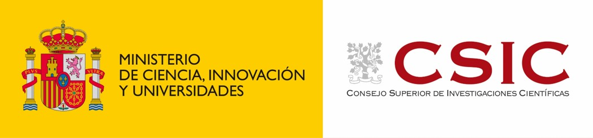
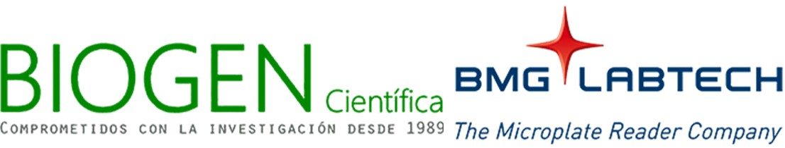
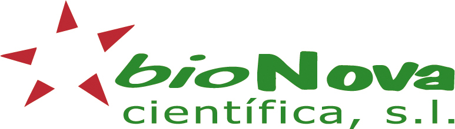
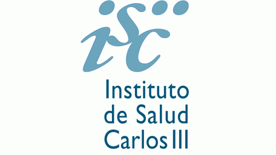
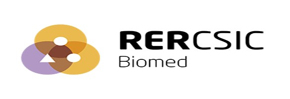
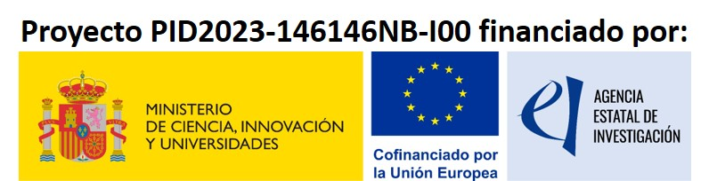

We gratefully acknowledge the support of our sponsors and partners.

## Our Sponsors

<!-- CSIC -->

  

<!-- Veterinary Research Journal -->

  

<!-- BIOGEN + BMG (logos fusionados mejorados) -->

  

<!-- Fundación Priónicas -->

  

<!-- bionova -->

  

<!-- ISCIII -->

  

<!-- RER -->

  

<!-- PID2023 -->

  

---

## Sponsorship Packages

Below you will find the available sponsorship options for the Iberian Prion Meeting 2026. All packages are designed to maximise visibility and engagement with attendees.

---

### Package 1 – €500

<ul>
<li>Inclusion of the company logo on the official conference website, in the programme, and in the abstract book.</li>
<li>Promotion of the company through our social media channels and official mailing list.</li>
</ul>

---

### Package 2 – €900

<ul>
<li>Inclusion of the company logo on the website, programme, and abstract book.</li>
<li>Promotion through social media and mailing.</li>
<li>Small stand in the <em>Claustro</em> during the conference (during both networking sessions, 17:00–19:00 on both days).</li>
</ul>

---

### Package 3 – €1,200

<ul>
<li>Everything included in Package 2.</li>
<li>10 + 5 minute commercial talk (10 minutes presentation + 5 minutes for questions).</li>
</ul>

---

### Package 4 – €1,600

<ul>
<li>Everything included in Package 2.</li>
<li>20 + 10 minute commercial talk.</li>
</ul>

---

### Package 5 – €2,000

<ul>
<li>Everything included in Package 4.</li>
<li>Double‑size stand in the <em>Claustro</em> during the conference (available from the Registration, poster set‑up and welcome coffee session, and during both networking sessions from 17:00 to 19:00 on both days).</li>
</ul>

---

## Comparison Table

| Feature | Package 1 (€500) | Package 2 (€900) | Package 3 (€1,200) | Package 4 (€1,600) | Package 5 (€2,000) |
|--------|------------------|------------------|---------------------|---------------------|---------------------|
| Logo on website, programme & abstract book | ✔️ | ✔️ | ✔️ | ✔️ | ✔️ |
| Social media & mailing promotion | ✔️ | ✔️ | ✔️ | ✔️ | ✔️ |
| Stand in the Claustro | — | Small stand | Small stand | Small stand | **Double stand** |
| Commercial talk | — | — | 10 + 5 min | 20 + 10 min | 20 + 10 min |
| Presence during networking sessions | — | ✔️ | ✔️ | ✔️ | ✔️ |
| Presence during registration & welcome coffee | — | — | — | — | ✔️ |

---

<a href="mailto:inia_iberianprion2026@inia.csic.es" style="display:inline-block; background-color:#C8102E; color:white; padding:12px 22px; border-radius:4px; text-decoration:none; font-weight:600;">
Contact the Organising Committee
</a>

