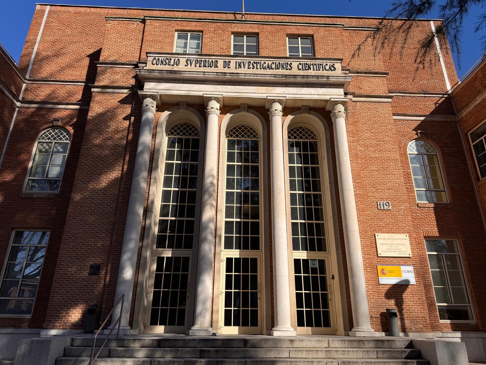
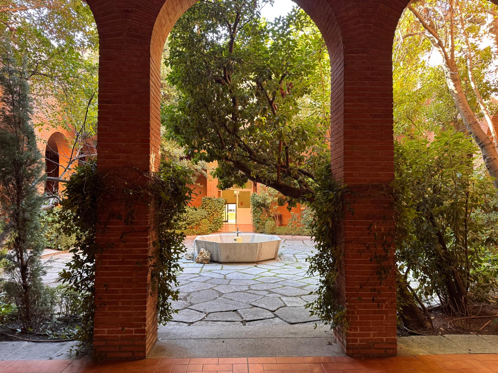
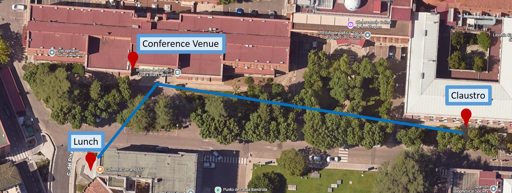
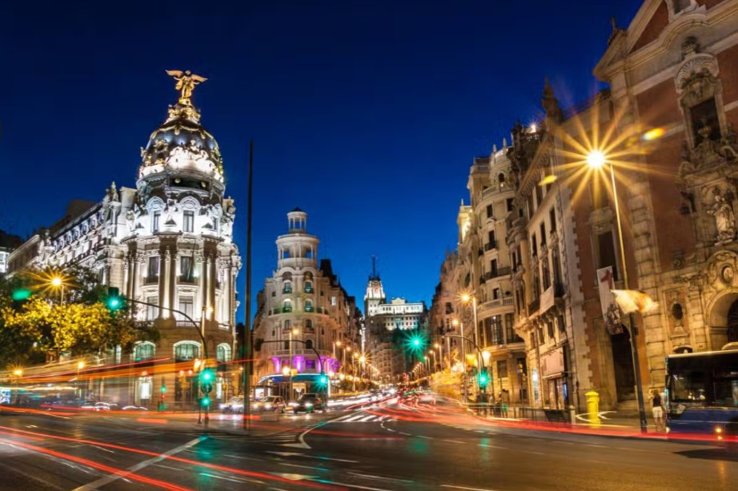

# Conference Venue

The Iberian Prion Meeting 2026 will take place in one of the most iconic scientific spaces in Madrid: the Assembly Hall of the Blas Cabrera (former Rocasolano) Institute of Physical Chemistry (119 Serrano Street).

This building is part of a campus with a remarkable history that shaped modern science in Spain.

## History of the venue

The story begins in 1932, when the Rockefeller Building was inaugurated thanks to the support of the Rockefeller Foundation. At that time, it housed the National Institute of Physics and Chemistry, a pioneering centre led by scientists such as Blas Cabrera and Enrique Moles. With state‑of‑the‑art laboratories and strong international connections, it quickly became one of the most advanced research institutes in Europe.

After the creation of the Spanish National Research Council (CSIC) in the 1940s, part of this scientific legacy evolved into the Rocasolano Institute, formally established in 1946 and named after Antonio de Gregorio Rocasolano, a key figure in the development of physical chemistry in Spain. Since then, the institute has been home to leading research in spectroscopy, molecular physics, structural chemistry, and biophysical sciences.

Today, the Blas Cabrera Institute continues to combine tradition and innovation, hosting cutting‑edge research while preserving the spirit of scientific curiosity that defined its origins. Its historic Assembly Hall—where the Iberian Prion Meeting 2026 will be held—has witnessed decades of lectures, discoveries, and scientific gatherings.

Celebrating the meeting here connects our community with a unique scientific heritage and offers an inspiring setting to discuss the latest advances in prion biology.

## Video

You can watch a short video about the history of the building here (audio in Spanish):  
[▶ Watch the history video](https://www.rtve.es/play/videos/la-aventura-del-saber/aventura-del-saber-90-aniversario-instituto-quimica-fisica-rocasolano-csic/6777230/?fbclid=IwY2xjawPAeH5leHRuA2FlbQIxMABicmlkETFJdUJQdWJYejVHc2FUazZvc3J0YwZhcHBfaWQQMjIyMDM5MTc4ODIwMDg5MgABHtvKzTDi0mDQsT-dT8AnX1A0KVfk1zhvw223eWoC1Z7WK6Tik3eFpEdtT2e7_aem_k5vhtTdKbjJuJQYdvM7fAw){.btn .btn-primary}

# Registration, poster sessions and coffee breaks

While the scientific sessions of the Iberian Prion Meeting 2026 will take place in the Assembly Hall of the Rocasolano Institute, several key activities will be hosted in another historic building just a few steps away.

Registration, poster sessions, and coffee breaks will be held in the Claustro, a beautiful cloister located within the Miguel A. Catalán Physics Centre, approximately 50 metres from the main hall. This space offers a quiet, open‑air atmosphere ideal for informal discussions, networking, and scientific exchange.

The Claustro is part of the CSIC’s central campus and reflects the architectural heritage of early 20th‑century Spanish science. Its covered walkways and central garden provide a unique setting for poster presentations and social interaction throughout the meeting.

To reach the Claustro from the Rocasolano Institute (Assembly Hall), simply walk across the internal campus path toward the Miguel A. Catalán Physics Centre, located just beyond the Blas Cabrera Institute. The route takes less than two minutes on foot.

📍 View campus map

## Don't miss the RESIDENCIA DE ESTUDIANTES

The *Residencia de Estudiantes*, located just a few steps from the Rocasolano Institute, is one of Spain’s most iconic cultural and scientific landmarks, associated with figures such as Lorca, Dalí, and Severo Ochoa. During the Iberian Prion Meeting 2026, we encourage all attendees to take advantage of its proximity and visit its historic gardens, buildings, and exhibitions **free of charge**. You can also enhance your visit with their **official audio‑guide app**, which offers a self‑guided tour of this unique space in several languages.

[Download on the App Store](https://apps.apple.com/es/app/gu%C3%ADa-residencia-de-estudiantes/id6608982839){.btn .btn-primary .me-2}
[Get it on Google Play](https://play.google.com/store/apps/details?id=com.residenciaapp&hl=es){.btn .btn-success}

<a href="https://residenciadeestudiantes.com/" style="display:inline-block; background-color:#C8102E; color:white; padding:12px 22px; border-radius:4px; text-decoration:none; font-weight:600;">
Visit the Residencia de Estudiantes
</a>

## Accommodation

Special discount for congress attendees at 1881 Madrid Ventas Hotel  
Promocode: **1881MADRIDVENTAS**

Bookings must be made through the hotel’s official website:  
https://www.1881madridventashotel.com/en/

10% discount applicable only to the flexible rate (non‑refundable rate excluded).  
Combinable with the exclusive website discount (10%) and the loyalty discount (5%).  
Free cancellation up to 48 hours before arrival.

How to apply the promocode:  
When selecting your dates and room type, you will find a field labelled “Promocode”. Enter **1881MADRIDVENTAS** in that box to activate the discount.

<a href="https://www.1881madridventashotel.com/en/" style="display:inline-block; background-color:#C8102E; color:white; padding:12px 22px; border-radius:4px; text-decoration:none; font-weight:600;">
Special Discount – 1881 Madrid Ventas Hotel
</a>

## How to get there. Travel Information

### Nearest airport

Adolfo Suárez Madrid–Barajas Airport (MAD) is the closest international airport, located approximately 12–15 km from Serrano 119. It offers extensive connections to Europe and major intercontinental hubs. Typical travel time to the venue ranges from 20 to 30 minutes depending on traffic and transport mode.

---

### Public transport options

Serrano 119 is well connected to Madrid’s public transport network, with several metro lines, bus routes, and train services within walking distance.

#### Metro

- **Line 6 – República Argentina** (5–7 minutes on foot)  
- **Line 9 – Concha Espina** (10 minutes on foot)  
- **Line 10 – Gregorio Marañón** (12 minutes on foot)

#### Bus (EMT Madrid)

Several bus lines stop directly along Calle Serrano, within 1–5 minutes of the venue:  
**5, 14, 27, 43, 120, 147, 150**

From the CSIC campus, reaching Madrid’s city centre by bus is straightforward. The **51 bus line**, which connects Plaza del Perú with Sol/Sevilla, stops at **Serrano / María de Molina** and **Serrano / Juan Bravo**, both just a short walk from the venue, and provides a direct route to **Sevilla and Sol**, right in the historic heart of the city. The **9 bus line**, running between Hortaleza and Sevilla, can be taken from nearby stops at **Príncipe de Vergara / María de Molina** and **López de Hoyos / Príncipe de Vergara**, also offering a direct connection to **Sevilla**, only a few metres from Sol. Both lines offer a comfortable 15–20 minute ride and are excellent options for travelling from Serrano to Madrid’s city centre.

#### Train (Cercanías Renfe)

The nearest station is **Nuevos Ministerios** (C1, C2, C3, C4, C7, C8, C10), about 15 minutes on foot or a short metro/bus ride. This station also connects directly with the airport via **Line C1**.

---

### Taxi and ride‑hailing services

Madrid offers reliable and widely available transport services.

- **Official taxis**  
  A typical ride from the airport to Serrano 119 takes 20–25 minutes. The airport applies a fixed fare to the city centre.

- **Ride‑hailing apps**  
  Uber, Cabify, and Bolt operate throughout Madrid. Pick‑up and drop‑off at Serrano 119 are straightforward due to wide sidewalks and clear access points.

---

### Recommended routes

#### From the airport (MAD)

- **Taxi / Ride‑hailing**: fastest and most direct option (20–25 min).  
- **Metro (around 40 min)**: Line 8 → Nuevos Ministerios → Line 6 → República Argentina → short walk to Serrano 119  
- **Train (Cercanías; around 40 min)**: Line C1 → Nuevos Ministerios → Metro Line 6 or walk to the venue

#### From Atocha train station

- **Metro (around 30 min)**: Line 1 → Cuatro Caminos → Line 6 → República Argentina  
- **Bus (around 30 min depending on traffic)**:  
  - Line 14 → Serrano – Juan Bravo  
  - Line 19 → Serrano – Rubén Darío (recommended)  
  - Line 27 → Castellana – Rubén Darío

## Visiting Madrid

Madrid, the vibrant capital of Spain, offers a rich blend of history, culture, and modernity. Visitors can explore world‑renowned museums, stroll through elegant parks, and enjoy a lively culinary and social atmosphere. Its dynamic neighbourhoods, monumental architecture, and exceptional artistic heritage make it one of Europe’s most engaging destinations.

Before exploring the wider highlights of the city, we encourage attendees to visit several outstanding museums located very close to the conference venue:

- **Museo Lázaro Galdiano** – Only a 3‑minute walk from the conference venue, this museum hosts an exceptional private art collection featuring works by Goya, El Greco, and Bosch.  
  [Visit Museo Lázaro Galdiano](https://www.museolazarogaldiano.es/)

- **Museo Arqueológico Nacional (MAN)** – About 15 minutes on foot, the MAN offers one of Europe’s finest archaeological collections, including Iberian sculptures, Roman mosaics, and medieval treasures.  
  [Visit the National Archaeological Museum](https://www.man.es/man/home.html)

- **Museo Nacional de Ciencias Naturales (MNCN‑CSIC)** – Around 20 minutes walking distance, this historic museum showcases extensive zoology, geology, and paleontology collections and forms part of the CSIC scientific heritage.  
  [Visit the Natural Science Museum](https://www.mncn.csic.es/es)

From the CSIC campus, reaching Madrid’s city centre by bus is straightforward. The **51 bus line**, which connects Plaza del Perú with Sol/Sevilla, stops at **Serrano / María de Molina** and **Serrano / Juan Bravo**, both just a short walk from the venue, and provides a direct route to **Sevilla and Sol**, right in the historic heart of the city. The **9 bus line**, running between Hortaleza and Sevilla, can be taken from nearby stops at **Príncipe de Vergara / María de Molina** and **López de Hoyos / Príncipe de Vergara**, also offering a direct connection to **Sevilla**, only a few metres from Sol. Both lines offer a comfortable 15–20 minute ride and are excellent options for travelling from Serrano to Madrid’s city centre.

## Tapas in Madrid

For those wishing to enjoy Madrid’s culinary atmosphere, the city offers countless options for traditional tapas. One of the most iconic places is the **Mercado de San Miguel**, a beautifully restored iron‑and‑glass market located next to Plaza Mayor. It brings together some of Spain’s best tapas counters, offering everything from seafood and croquetas to gourmet cheeses, pastries, and regional wines.  
[Visit Mercado de San Miguel](https://www.esmadrid.com/en/shopping/mercado-de-san-miguel)

## Places not to be missed

Here are some of the places not to be missed in Madrid, each offering a unique glimpse into the city's rich history, culture, and charm:

1. **The Prado Museum** – One of the world’s greatest art galleries, home to masterpieces by Velázquez, Goya, and El Bosco.  
2. **Reina Sofía Museum** – Spain’s national museum of modern art, featuring Picasso’s iconic *Guernica*.  
3. **Thyssen‑Bornemisza Museum** – Completes the “Golden Triangle of Art” with works from Van Gogh, Monet, and Hopper.  
4. **Royal Palace of Madrid** – A grand architectural landmark and official residence of the Spanish monarchy.  
5. **Puerta del Sol** – The symbolic heart of Madrid and the starting point of Spain’s radial road system.  
6. **Plaza Mayor** – A historic square surrounded by arcades, ideal for strolling and enjoying traditional tapas.  
7. **Retiro Park** – A lush green oasis with sculptures, fountains, and the stunning Crystal Palace.  
8. **Gran Vía** – Madrid’s vibrant avenue lined with theatres, shops, and iconic buildings.  
9. **Temple of Debod** – An ancient Egyptian temple offering beautiful sunset views over the city.  
10. **Cibeles Palace and Fountain** – A majestic civic building and one of Madrid’s most photographed landmarks.  
11. **Puerta de Alcalá** – A neoclassical triumphal arch and symbol of Madrid’s imperial past.  
12. **Plaza de España & Torre de Madrid** – A spacious plaza with monuments and views of the city skyline.

## Beyond Madrid

Madrid’s privileged location makes it an ideal base for exploring some of Spain’s most remarkable historic cities. All of them are easily accessible by train—some in under 30 minutes—offering perfect cultural getaways before or after the congress.

1. **Alcalá de Henares** – A UNESCO World Heritage city known for its historic university and as the birthplace of Miguel de Cervantes.  
   Distance from Madrid: ~35–41 km  
   Train time: 29–39 minutes on Cercanías trains

2. **Segovia** – Famous for its spectacular Roman aqueduct, fairy‑tale Alcázar, and Gothic cathedral.  
   Distance from Madrid: ~90–97 km  
   Train time: 28–35 minutes on high‑speed AVE/Avlo trains

3. **Toledo** – The “City of Three Cultures,” known for its cathedral, medieval streets, and panoramic views over the Tajo River.  
   Distance from Madrid: ~73–87 km  
   Train time: 33 minutes on AVE trains

4. **Aranjuez** – Renowned for its Royal Palace and vast historic gardens.  
   Distance from Madrid: ~47–50 km  
   Train time: 45–55 minutes on Cercanías or regional trains

4. **San Lorenzo de El Escorial** – Home to the monumental Royal Monastery of El Escorial.  
   Distance from Madrid: ~49–58 km  
   Train time: 55–65 minutes on regional trains

5. **Ávila** – A walled medieval city famous for its perfectly preserved ramparts and Romanesque churches.  
   Distance from Madrid: ~109–117 km  
   Train time: 1h 20–1h 40 on regional or Media Distancia trains

More information on the Official tourism website (available in several languages):  
[🌐 Official Madrid Tourism Website](https://www.esmadrid.com/en){.btn .btn-primary}

We hope you enjoy your visit!
